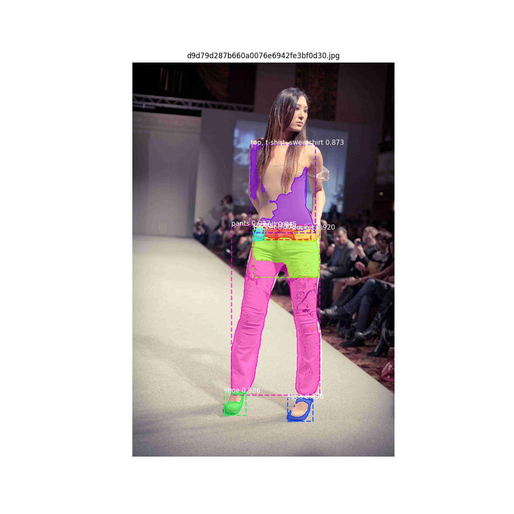

# segmentation models
## models 
1. enet
2. fashion ai segmentation 
3. fashion chalenge segmentation 
4. keras deeplab 
5. mask Rcnn
6. opencv 
7. yolo v3

### enet
- implemetation : https://github.com/TimoSaemann/ENet/tree/master/Tutorial
- platform : caffe
- output example : 
- model : exist 

### fashion ai segmentation 
- implementation : https://github.com/anish9/Fashion-AI-segmentation
- platform : keras
- output example : 
- model : exist 

### fashion chalenge segmentation imaterialist
- implementation : https://www.kaggle.com/c/imaterialist-fashion-2019-FGVC6/notebooks   
https://towardsdatascience.com/dress-segmentation-with-autoencoder-in-keras-497cf1fd169a  
- platform : keras (mask rcnn)
- output example : 
- model :  not exist

### keras deeplab 
- implementation : https://github.com/bonlime/keras-deeplab-v3-plus    
https://github.com/MLearing/Keras-Deeplab-v3-plus/   

- platform : keras
- output example : 
- model :  exitst

### mask Rcnn
- implementation : https://github.com/matterport/Mask_RCNN
- platform : tensorflow, keras
- output example : 

### opencv 
- implementation : https://docs.opencv.org/master/d3/db4/tutorial_py_watershed.html  
- platform : opencv
- output example : 
- work with contours and colors.  

### darknet, yolo v3 , box extraction
- implementation : https://pjreddie.com/darknet/
- platform : c , yolo v3
- output example :    
  

- model : exist

### deep_fashion
- dataset : http://mmlab.ie.cuhk.edu.hk/projects/DeepFashion.html   
- implementations : https://github.com/abhishekrana/DeepFashion   
https://github.com/parap1uie-s/Keras-RFCN     
https://medium.com/@birdortyedi_23820/deep-learning-lab-episode-4-deep-fashion-2df9e15a63e1  
https://medium.com/@manjabogicevic/100-days-of-machine-learning-code-deep-fashion-classification-dataset-ccc331940e57    

 
